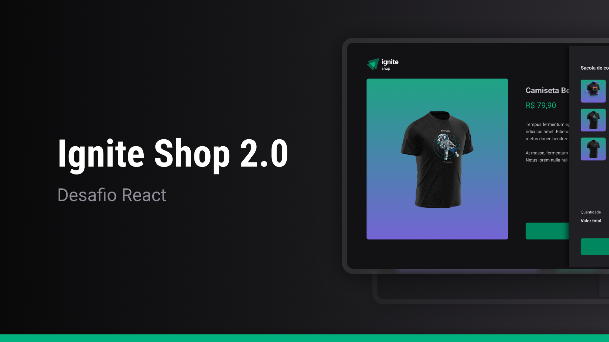

<h1 align="center"> Desafio - Ignite Shop </h1>

Uma aplicação de e-commerce fictício feita como forma de um desafio do curso ReactJS da Rocketseat

<a href="">🔗 Live Preview</a>&nbsp;&nbsp;&nbsp;|&nbsp;&nbsp;&nbsp;
<a href="#-tecnologias">🚀 Tecnologias</a>&nbsp;&nbsp;&nbsp; |&nbsp;&nbsp;&nbsp;&nbsp;
<a href="#-aprendizados">📚 Aprendizados</a>

## 🚀 Tecnologias

Esse projeto foi desenvolvido com as seguintes tecnologias:

- React
- TypeScript
- FIGMA

## 📚 Aprendizados

Este projeto foi feito como forma de um desafio dentro do curso de ReactJS no módulo "Primeiro framework" da Rocketseat.
Nele pude consolidar os conhecimentos sobre:

### React
- Next.js (SPA, SSR e SSG)
- Integração HTTP (Fetch/Axios)
- Stripe API
